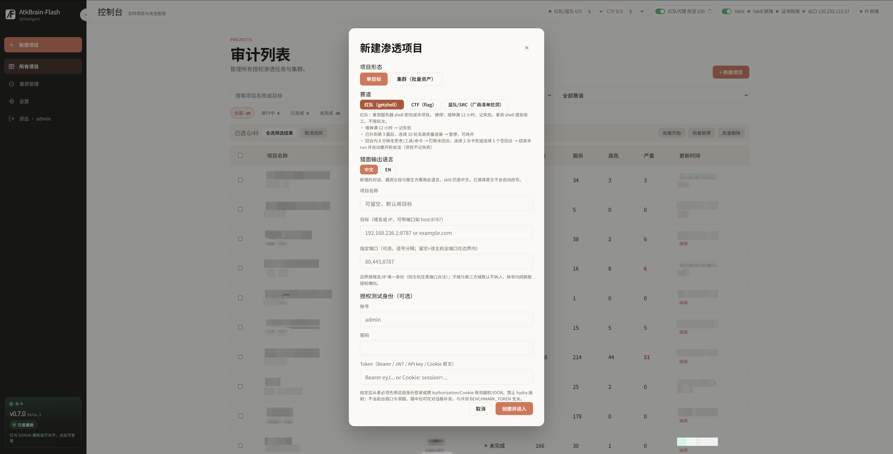
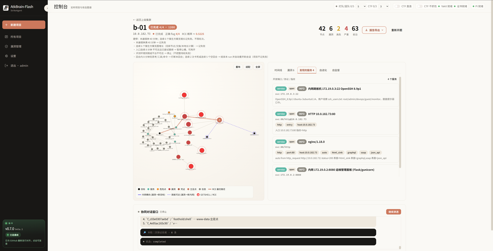
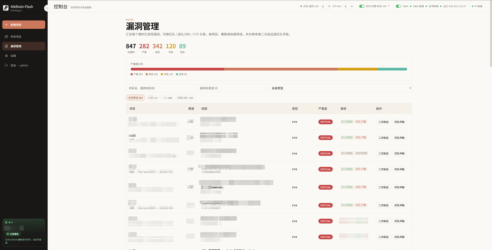

<p align="center">
  <a href="README.en.md">English</a>
</p>

<p align="center">
  
  
  
</p>

<p align="center">
  <sub>StrikeAgent × 夜安团队 SEC</sub>
</p>

<h1 align="center">StrikeAgent_AtkBrain-Flash</h1>


此项目由夜安团队开发，旨在探索 AI 渗透方面的能力，希望做点有自己思想的东西而不是 Ai 千篇一律随便搞出来的。

项目看似简单，实则经过多轮实战：Flash 版死磕「不打歪又能长攻击面」；红队二次评级和二次验证，让漏洞拿着就能用。团队自用 Pro 已落地几十个项目、超千个外网授权环境，只聚焦外网打点。

## 架构

控制台调度猎面；攻击图驱动自循环。从者整轮打完再问御主，卡住或到周期才开口；对话框里的人工指令立刻打断本轮。收工把手法蒸馏进记忆库。运行时是 Pi（`deepseek-flash`）。红队 / 蓝队/SRC 的 HTTP 第一跳是本机 Yakit MITM，下游仍是出口代理池。


## 产品页面展示

产品全貌：


首页及新建任务：单目标 / 集群；红队（getshell）、CTF（flag）、蓝队/SRC。



项目控制台：攻击图、时间线、漏洞、对话。



漏洞库：



## 交付报告

<p><i>此报告为一次真实的授权业务场景</i></p>

[打开 HTML](docs/demo/intranet-lab-report.html)


## 排行榜

Tsecbench v1 **第 1 名**（`StrikeAgent_AtkBrain-Flash`，97.89 / 100）。腾讯安全云鼎实验室的智能攻防 Agent 评测。


## 为了平台安全所做的努力

未授权访问拿不到登录页、接口和明文口令。

- **随机入口：** 8 位路径只写本机 `backend/data/security_entry`（`0600`）；网页/API 看不到。`python -m atkbrain.panel` 打印 URL。
- **无入口无子目录：** 裸 `:2334/` 是介绍页；`/login`、`/api`、`/.env` 等一律 404。
- **防抓包 / 重放 / 爆破：** 浏览器 RSA-OAEP 加密后再 POST；一次性 ticket（120s）；按用户名/IP 锁定。
- **口令：** 库里 Argon2id；本机 `admin_bootstrap.secret`（`0600`）给有 shell 的人，`panel` 可打印。
- **会话：** Cookie `HttpOnly`；无 `?token=`；Swagger 关闭。默认 HTTPS `:2334`。

## 环境与安装

Docker（Kali，host 网络）：

```bash
git clone <本仓库 URL>
cd StrikeAgent_AtkBrain-Flash
# 进入项目根目录（有 compose.yaml、.env.example 的那一层）
cp .env.example .env
# 打开 .env，填 DEEPSEEK_API_KEY=你的密钥（猎面调模型用；不填控制台能开、猎面不跑）
docker compose -f compose.yaml -f deploy/compose.build.yaml up -d --build --wait
# 编镜像、启动容器，等到探活通过再返回
docker compose exec atkbrain python -m atkbrain.panel
# 打印带随机入口的 https 登录地址和当前口令（只这台机器能看）
```

用 panel 打印的 **https** 地址（自签证书点继续）。首次 `admin` / `admin`，登录后必须改密。控制台 `:2334`，API `:2333`。不要和本机 systemd 抢端口。

忘入口或口令：再跑上面的 `panel`。若提示没有明文副本，在 `.env` 设 `ATKBRAIN_ADMIN_PASSWORD` 与 `ATKBRAIN_ADMIN_PASSWORD_RESET=1`，`docker compose up -d`，确认后再把 RESET 改回 `false`。

本机不用 Docker：`sudo scripts/atkbrain-up.sh`。数据都在 `backend/data/`（gitignore），升级不覆盖。

## 开源协议与免责声明

**AGPL-3.0-only** — 个人和开源免费。商业许可：[gavenmiya@outlook.com](mailto:gavenmiya@outlook.com)。正文见 [LICENSE](LICENSE)。

仅限已获明确授权的环境。使用即表示你已获得授权并自行承担后果。

交流群已满。关注公众号「夜安团队SEC」联系拉群。


