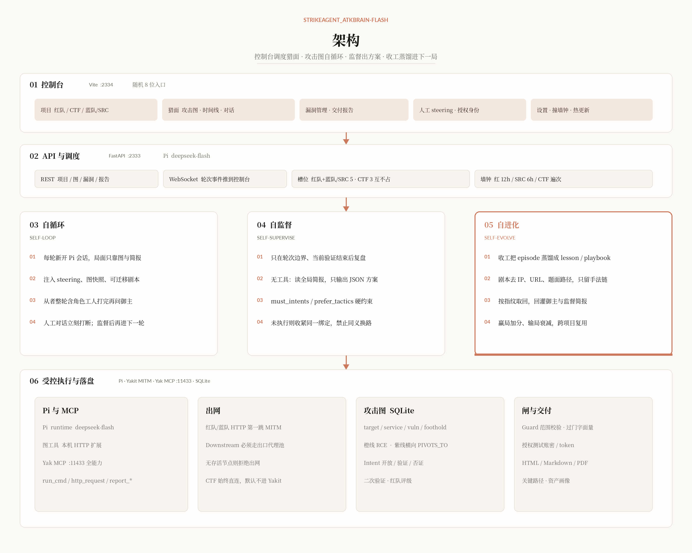
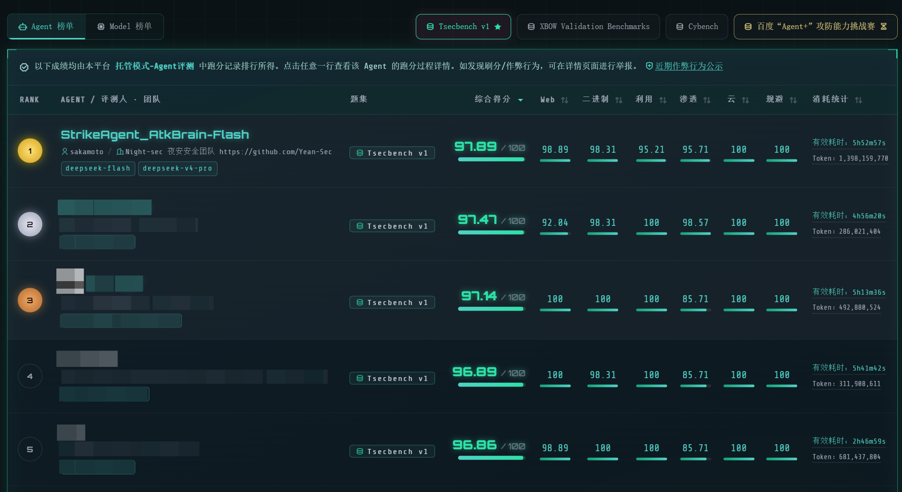

<p align="center">
  <a href="README.zh.md">中文</a>
</p>

<p align="center">
  
  
  
</p>

<p align="center">
  <sub>StrikeAgent × Yean-Sec</sub>
</p>

<h1 align="center">StrikeAgent_AtkBrain-Flash</h1>


Built by Yean-Sec to explore what AI can actually do in authorized offensive security — something with its own ideas, not another generic “AI pentest” wrapper.

The console looks simple. It is not. It went through many live engagements. A lot of the work is in the small rules: stay on target while still growing the attack surface (Flash). Red-team re-rating and a second verification pass exist so findings are usable, not inflated.

The team’s private Pro build has already been used on dozens of programs and well over a thousand authorized internet-facing environments. Everything here is aimed at that one job: external foothold work, done well.

## Architecture

The console schedules hunts; the attack graph drives the self-loop. The servant finishes a full round (including role workers) before asking the master. It only speaks when stuck or when a clock fires. A human message in the chat interrupts the current round and forces a new direction. After a hunt, transferable tradecraft is distilled into memory for the next one.

Runtime is Pi (`deepseek-flash`), not Claude Code. For red team / Blue team/SRC, the first HTTP hop is local Yakit MITM; the next hop is still the egress proxy pool. Graph tools use a local HTTP extension. Full Yakit capability goes through local Yak MCP.



## Product screens

New project: single target or cluster; three tracks — red team (getshell), CTF (flag), Blue team/SRC (vendor list hunting).


Console: attack graph, timeline, findings, chat.


Intranet lateral: orange is the RCE path; solid purple is a controlled hop across hosts; dashed purple is pivot-reachable.


## Delivery report

 <p><i>This report is from a real authorized engagement.</i></p>

Delivery report: [open HTML](docs/demo/intranet-lab-report.html)


Critical path:


Asset picture:


## Ranking

Latest board: **1st** on Tsecbench v1 (`StrikeAgent_AtkBrain-Flash`, 97.89 / 100).

Tsecbench is an intelligent offense-defense agent evaluation system from Tencent Security YunDing Lab. It focuses on validating automated red-team and adversarial AI. Using real vulnerabilities, production-grade ranges, and red-blue environments, it scores AI on autonomous pentest, vulnerability discovery, and adversarial play under a single standard — quantifying defense gaps from an attacker’s point of view, so intelligent offense-defense capability can be measured.



## What we do for platform security

The hunt engine attacks authorized targets. The machine that hosts this console is treated as if `:2334` is reachable from the internet. The goal is that an unauthorized visitor does not get a login page, an API, or a password on the wire.

- **Random login URL.** An 8-character mixed-case entrance is generated with `secrets` on this host and stored only in `backend/data/security_entry` (mode `0600`). The web UI and APIs cannot read or change it. Only a shell on this machine — `scripts/atkbrain-panel.sh` or `cd backend && python3 -m atkbrain.panel` — prints the full URL.
- **No leaked subpaths.** Bare `:2334/` is the public product page. Guessed paths such as `/login`, `/admin`, `/api`, `/docs`, `/.env`, and `/.git` return **404**. `/api/health` without the entrance is also 404 on the LAN (probes use `python3 -m atkbrain.healthcheck` on loopback, with the prefix).
- **Anti packet-capture of the password.** The browser encrypts the password with RSA-OAEP SHA-256 before POST. A passive HTTP capture does not see the plaintext. Without TLS, an active MITM can still swap the public key — put HTTPS in front for that.
- **Anti-replay.** Each login fetches a one-shot ticket (120s TTL). The ciphertext also carries a nonce and a timestamp; the ticket is consumed on use. Replaying a captured blob fails.
- **Anti-bruteforce.** Failures lock by username (5 fails in 15 minutes → 15-minute lock) and by IP (20 fails in one hour → 1-hour lock). Locks live in SQLite and survive process restart. Unknown users still run Argon2 so timing does not leak whether the account exists.
- **Hashes in the DB, a 0600 copy on disk for the operator.** Passwords are Argon2id in SQLite. A plaintext copy lives in `backend/data/admin_bootstrap.secret` (mode `0600`). The web UI and APIs cannot read it; `python -m atkbrain.panel` can. The first login retires factory `admin` / `admin`. Changing the password in Settings updates that file.
- **Session and API hygiene.** Cookie `HttpOnly` + `SameSite=Lax`; no `?token=` query string; Origin/Referer must match on login and password change. OpenAPI / Swagger are off. The `Server` header is off.

## Environment and install

### One-click Docker

On Linux (Kali) this is the same feature set as local systemd: console `:2334`, API `:2333`, Pi, skills/tools, Yakit MCP `:11433`, MITM `8084–8107`, egress proxy pool, login, data in `backend/data/`. Containers use **host networking**, so `127.0.0.1`, local proxies, and local labs behave like a native install.

Do not fight ports with a running `atkbrain-flash-backend` / `atkbrain-flash-frontend`. Stop those units first, or use a machine that is not using 2333/2334.

The root `Dockerfile` is still the TSecBench hosted image (no console frontend, no Yak, pulls tasks on start). **Do not** use it as the daily console.

```bash
git clone <this repo URL>
cd StrikeAgent_AtkBrain-Flash
cp .env.example .env
# Edit .env: at least DEEPSEEK_API_KEY (or ANTHROPIC_AUTH_TOKEN)
docker compose -f compose.yaml -f deploy/compose.build.yaml up -d --build --wait
```

Do not open the root path in a browser. On the host, run:

```bash
docker compose exec atkbrain python -m atkbrain.panel
```

That prints a login URL with the **8-character random entrance** and the current password. The entrance is generated with `secrets` on this host and stored only in `backend/data/security_entry` (mode 0600); the password plaintext is only in `backend/data/admin_bootstrap.secret` (mode 0600). The web UI and APIs cannot read or change either. Without that path, the host shows the StrikeAgent product page (no redirect); `/login`, `/api/health`, and `/docs` do not expose the console. The first login page still shows default **`admin` / `admin`**; you must change the password after login. If you close the page without changing it, the default is retired — use the `panel` command above to read the system-generated 8-character password. Later changes in Settings are also printed by `panel`. If you forget the entrance or need a new one, you need a shell on this machine (`python -m atkbrain.panel` to view; delete `security_entry` and restart to roll a new one). On the LAN, replace the IP in the URL with the Kali address.

`--wait` returns after the local probe succeeds (`python3 -m atkbrain.healthcheck`, entrance + loopback; not reachable from a WAN scan). The first build pulls Node/Python images, compiles the frontend, and installs Pi and Yak — that takes a while.

Day to day:

```bash
docker compose -f compose.yaml up -d --wait          # existing image, start only
docker compose -f compose.yaml logs -f atkbrain
docker compose -f compose.yaml restart
docker compose -f compose.yaml down
```

After changing frontend or backend source, rebuild with `deploy/compose.build.yaml` and `--build` again.

Config (`.env`, same `ATKBRAIN_*` / `DEEPSEEK_*` names as the host):

| Variable | Docker default | Role |
| --- | --- | --- |
| `DEEPSEEK_API_KEY` | (empty) | Model key; required for hunts |
| `ANTHROPIC_AUTH_TOKEN` | (empty) | Key alias; synced with DeepSeek at the entrypoint |
| `ATKBRAIN_ADMIN_USER` / `ATKBRAIN_ADMIN_PASSWORD` | `admin` / `admin` | Written once; password change is forced after login |
| `ATKBRAIN_ADMIN_PASSWORD_RESET` | (empty) | `1` overwrites the stored hash with the current password (no extra auto-rotate) |
| `ATKBRAIN_SECURITY_ENTRY` | (empty = host-generated random) | Only `off` disables it (local `npm run dev`); you cannot pin a custom path |
| `ATKBRAIN_HOST` / `ATKBRAIN_PORT` | `0.0.0.0` / `2333` | API listen; `:2334` is forwarded here |
| `ATKBRAIN_CORS_ORIGINS` | local `2334` and `2333` | Do not use `*` once cookies are on |
| `ATKBRAIN_YAKIT_MCP_FULL_PORT` | `11433` | In-container `yak mcp --enable-all`; does not steal Cursor’s 11432 on the host |
| `ATKBRAIN_YAKIT_MITM_PORT` | `8084` | Preferred MITM port; walks forward to 8107 if taken |

After it is up, the top bar should show Pi ready, Yakit ready, and cert ready (`yak` is in the image; MCP and the MITM CA start on first boot). Save an egress proxy pool in Settings before red-team / Blue team/SRC hunts. Data, DB, workspaces, `yakit-mitm-ca.pem`, and `yakit-mcp.log` live in the repo’s `backend/data/` (volume). Do not commit them.

Checks:

```bash
docker compose exec atkbrain python -m atkbrain.panel
cd backend && python3 -m atkbrain.healthcheck
# Loopback with entrance; health includes Pi/Yakit detail only after keys are set and you are logged in
curl -sS -o /dev/null -D- http://127.0.0.1:2334/
# Without the entrance: root is 200 product page; other subpaths are 404
```

If Docker Desktop / non-Linux has no host network, add a port-map overlay (do not use this on Kali, or MITM and local proxies will not line up):

```bash
docker compose -f compose.yaml -f deploy/compose.build.yaml -f deploy/compose.bridge.yaml up -d --build --wait
```

On bridge network, the container’s `127.0.0.1` is not the host; write local proxies and local labs as `host.docker.internal`.

### Upgrades and moving data

**An upgrade does not wipe hunt history.** Projects, attack graphs, findings, chat, workspaces, loot, reports, the admin password hash, the 8-character entrance, proxy / Yakit settings, and the MITM CA all live under `backend/data/` (gitignored). The login **Apply update** button runs `scripts/atkbrain-upgrade.sh <tag>`: it checks out that GitHub tag, or overlays a source tarball that **skips** `backend/data/`, `*.env`, `frontend/node_modules/`, and `frontend/dist/`. Compose bind-mounts `./backend/data` into the container, so `--build`, recreate, and `docker compose down` leave that directory on the host.

Do not run `git clean -fdx` around an upgrade (it deletes gitignored `backend/data`). Do not clone into a new folder and start Docker there expecting old projects. Live or queued hunts block apply (HTTP 409); stop them first so SQLite (`atkbrain.db` plus `-wal` / `-shm`) is consistent.

**systemd install → Docker on this machine**

Use the **same clone**. Docker mounts this repo’s `backend/data/`; a second clone is a new empty library.

```bash
# 1. Stop hunts in the console, then stop the units (they fight :2333 / :2334):
sudo systemctl stop atkbrain-flash-backend atkbrain-flash-frontend
sudo systemctl disable atkbrain-flash-backend atkbrain-flash-frontend   # optional, so they do not return on boot

# 2. Model key for compose (systemd kept a snapshot at backend/data/atkbrain-claude.env)
cp -n .env.example .env
# Copy DEEPSEEK_API_KEY / ANTHROPIC_AUTH_TOKEN into .env.
# Leave ATKBRAIN_ADMIN_PASSWORD_RESET unset so the existing admin hash is kept.

# 3. Same directory:
docker compose -f compose.yaml -f deploy/compose.build.yaml up -d --build --wait
docker compose exec atkbrain python -m atkbrain.panel
```

The entrance and the password you already changed stay. First-boot `admin` / `admin` is not written again when `atkbrain.db` already has a user.

**Copy a systemd install onto Docker on another host**

Stop the source backend first so `atkbrain.db` and `atkbrain.db-wal` are a consistent pair. Copy the whole `backend/data/` tree **with permissions** (`security_entry`, `auth-rsa.pem`, `auth-session.key`, `atkbrain-claude.env` are mode `0600`). Put the model key in the destination `.env`. Copy **before** the first `docker compose up` on the destination. If Docker already created a fresh entrance and an empty DB, stop the container, replace that host’s `backend/data/` with the copy, then start again. Do not merge two databases. `backend/data/logs/` is optional.

**Replacing only the db is not a full migrate.** `atkbrain.db` holds the project list, attack graph, findings, timeline, memory, and the admin password hash. Workspace paths are `backend/data/workspaces/<project id>/` — the db stores the id, the files live on disk. Swap the db and the console can open old projects; the workspace is empty, so resume, loot, and cached HTML reports will not match.

Still outside the db (a db-only swap does **not** bring these):

| Path | If you skip it |
| --- | --- |
| `workspaces/`, `loot/`, `reports/` | Hunt files and downloadable reports are gone |
| `security_entry` | The 8-character entrance is new; the old URL does not open the console |
| `proxy-settings.json` | Proxy pool, Yakit switch, and wall clocks go back to defaults |
| `yakit-mitm-ca.pem` | Download the MITM cert again |
| `atkbrain.db-wal` / `atkbrain.db-shm` | Copying only `.db` while WAL exists can drop the last writes or corrupt the library |

The password hash is in the db, so after a db-only swap you still use the source machine’s changed password, not Docker’s first-boot `admin` / `admin`. The entrance file does not follow; the login URL stays that host’s own 8 characters.

If you only swap the db: stop the source backend, copy `atkbrain.db` **together with** `atkbrain.db-wal` and `atkbrain.db-shm` (omit wal/shm if they are absent). Stop the destination container, replace the files, then start. Do not overwrite a running library. To resume hunts and download reports, still copy the whole `backend/data/` tree. A db-only swap is enough only if you just need the history visible in the console.

### Agent deploy prompt

Give the block below plus the source tree to any AI that can run commands on the host. It should deploy as written: do not change how skills are bound, and do not hard-code paths from someone else’s machine.

```
Deploy StrikeAgent_AtkBrain-Flash from this source tree to a working console on this host. Target OS is Kali Linux (Debian-family, systemd, sudo). Do not use Docker as the primary path. Do not install hunt skills from this repo into ~/.claude or ~/.pi. Do not hard-code paths such as /home/kali/桌面/... or any other cloner’s directories.

1. Directory and process discipline
- Repo root is REPO (contains backend/, frontend/, scripts/, skills/, tools/, pi/).
- Backend :2333, frontend :2334. Do not start python3 -m atkbrain.main or npm run dev in a scratch shell; they fight systemd for ports.
- Backend interpreter must be /usr/bin/python3 (3.12+), packages on system Python. Do not install only into a venv while the unit still runs system python.
- Data, DB, workspaces, keys, MITM CA only under backend/data/ (already gitignored). Do not commit .env, *.db, workspaces, loot, atkbrain-claude.env, yakit-mitm-ca.pem.
- Start/restart only with: sudo scripts/atkbrain-up.sh (first time), sudo scripts/atkbrain-backend.sh restart, sudo scripts/atkbrain-frontend.sh restart. Unit names: atkbrain-flash-backend.service / atkbrain-flash-frontend.service.
- Do not copy yaklang/yakit source into this repo. A local Yak engine is enough; Flash is an MCP client and does not vendor Yakit.

2. Dependencies
- sudo apt: python3 python3-pip python3-dev build-essential nodejs npm curl; for PDF export also libcairo2 libpango-1.0-0 libpangocairo-1.0-0 libgdk-pixbuf-2.0-0 libffi-dev shared-mime-info.
- pip: sudo /usr/bin/python3 -m pip install -r backend/requirements.txt --break-system-packages
- Frontend: cd frontend && npm install (frontend/node_modules must exist before atkbrain-up.sh)
- Global Pi: sudo npm install -g @earendil-works/pi-coding-agent; local `pi --version` works (DEEPSEEK_API_KEY, optional ANTHROPIC_AUTH_TOKEN alias).
- Local `yak` works (Yakit / Yaklang engine). Do not git clone yaklang/yakit into this repo. If yak is missing from PATH, the top bar stays “Yakit not ready”.
- Have DEEPSEEK_* / ANTHROPIC_* / ATKBRAIN_* / PI_* in the current shell before sudo scripts/atkbrain-up.sh. The script snapshots keys into backend/data/atkbrain-claude.env (mode 600). systemd PATH must include pi and yak.

3. Skill / tool paths (easiest place to get the deploy wrong)
Hunt Pi cwd is backend/data/workspaces/<project id>/, not the repo root. Skills are bound to this repo, not the user global environment. Graph tools go through REPO/pi/extensions/atkbrain-tools.ts (local HTTP). Do not install the Claude Agent SDK. Yakit goes through local Yak MCP (Streamable HTTP), discovered or spawned by the backend; do not copy Cursor’s mcp.json into the repo.
- Sources: REPO/skills/kali-kit, recon-fanout, recon-spiral, src-hunt-playbook, waf-bypass-methodology. Git only; do not copy into ~/.claude or ~/.pi; do not change Pi user-level settings to install skills.
- Runtime: session start copies track skills into that hunt workspace backend/data/workspaces/<pid>/.agents/skills/. Pi loads them with --skill exactly.
- Scheduling: the master plan starts role workers concurrently (Python starts Pi processes). Do not use Claude Code Task/Agent. Workers must not spawn further children.
- kali-kit must not hard-code host paths. Repo skills/kali-kit/SKILL.md uses placeholder <REPO>. The copy the servant actually sees is generated by backend/atkbrain/agents/kali_kit.py skill_markdown() with REPO_ROOT (parent of backend). project_skills.install_into_workspace overwrites the workspace kali-kit/SKILL.md after copy. Do not rewrite SKILL.md to an absolute path on one machine.
- Scripts that Kali does not ship, and that this repo vendors, must be invoked with repo-absolute paths (workspace cwd will not find relatives):
  python3 $REPO/tools/JSFinder/JSFinder.py -u <url> -ou js_urls.txt -os js_subs.txt
  bash $REPO/tools/bypass-403/bypass-403.sh http://<host> <path>
  Do not which jsfinder / which bypass-403, and do not copy those scripts into /usr/bin.
- nmap / ffuf / nuclei use system absolute paths (/usr/bin/...), listed in kali-kit. Do not which / ls /usr/share/wordlists.
- Do not dump the full kali-kit into the system prompt; the servant calls skill kali-kit when it needs paths. CTF opening read recon-fanout; red team opening read recon-spiral; Blue team/SRC opening read src-hunt-playbook. Read waf-bypass-methodology when an exploit payload is blocked by WAF/403/406; path-level 401/403 still uses kali-kit bypass-403.

4. Yakit MCP and MITM cert
- Red team / Blue team/SRC: the servant’s first HTTP hop must be local MITM (default idle port from 127.0.0.1:8084, range 8084–8107). DownstreamProxy must be the egress proxy pool. Do not stack proxychains on MITM. Do not leak the real IP while egress is on. CTF does not enter MITM by default.
- Yak MCP: prefer the local full-capability port already listening at http://127.0.0.1:11433/mcp (`yak mcp --enable-all`). If Cursor holds 11432, do not steal it and do not use the 11432 CA to verify 11433 MITM. If nothing is listening, the backend self-spawns 11433.
- Cert: backend uses MCP tool download_mitm_cert into backend/data/yakit-mitm-ca.pem. Top-bar “cert ready” means the file is readable and unexpired, and that CA verifies the current MITM HTTPS leaf. After the engine changes port, the old CA is dead — download MITM cert again from Settings.
- Top bar keeps probing: Yakit ready / cert ready / verified egress IP (icanhazip through MITM; must equal the pool node). Settings has the Yakit switch, backup downstream, and cert download.

5. Checks
Use scripts/atkbrain-panel.sh (or cd backend && python3 -m atkbrain.panel) for the login URL with the random entrance. Do not treat bare http://127.0.0.1:2334/ as the console (product page only).
cd backend && python3 -m atkbrain.healthcheck
  expect ok: true; claude_sdk.label “Pi ready” (field name is still claude_sdk, meaning Pi); after Yakit is on, yakit.engine.label “Yakit ready”, yakit.cert.label “cert ready”, yakit.mitm.verified true
curl -sS -o /dev/null -w '%{http_code}\n' http://127.0.0.1:2334/   expect 200 (product page)
On failure, read backend/data/logs/backend.err.log, frontend.err.log, backend/data/yakit-mcp.log: missing packages, port in use, pi/yak not in the unit PATH, keys not snapshotted, or CA not matching the current MCP engine.
```

### Environment

Prefer **Kali Linux** (the execution layer calls local offensive tools). Other Debian / Ubuntu can start the console, but the toolset may be incomplete.

| Dependency | Version / notes |
| --- | --- |
| OS | Kali / Debian-family, systemd, root (`sudo`) |
| Python | `/usr/bin/python3`, **3.12+**. The backend unit runs this interpreter; do not only install into a venv |
| Node.js / npm | **18+** (Pi prefers a recent Node) |
| Pi | Local `pi` works: `npm i -g @earendil-works/pi-coding-agent`, with `DEEPSEEK_API_KEY` |
| Yak / Yakit | Local `yak` works (Yakit engine). Flash talks Streamable HTTP MCP and does not vendor yakit source |
| Ports | **2334** console, **2333** API; Yak MCP default **11433** (full capability, does not steal Cursor’s 11432); MITM **8084–8107** |
| Disk | `backend/data/` holds DB, workspaces, logs, reports, `yakit-mitm-ca.pem` |

System packages (Kali / Debian):

```bash
sudo apt update
sudo apt install -y python3 python3-pip python3-dev build-essential \
  nodejs npm curl
# weasyprint needs these for PDF export; hunts still run without them, PDF export fails
sudo apt install -y libcairo2 libpango-1.0-0 libpangocairo-1.0-0 \
  libgdk-pixbuf-2.0-0 libffi-dev shared-mime-info
```

Install Pi:

```bash
sudo npm install -g @earendil-works/pi-coding-agent
pi --version
```

Yakit engine (local `yak`; do not copy source into this repo):

```bash
command -v yak
yak version   # or yak --version
```

If `yak` is missing, install the Yak engine from [Yakit](https://github.com/yaklang/yakit). The backend self-spawns when needed:

```bash
yak mcp --transport streamable_http --host 127.0.0.1 --port 11433 --enable-all
```

If Cursor already runs Yak MCP on `127.0.0.1:11432/mcp`, leave it for Cursor. Flash uses 11433 full-capability; the two CAs must not be mixed.

Model keys are environment variables. The install script snapshots them to `backend/data/atkbrain-claude.env` (mode `600`, do not commit):

| Variable | Role |
| --- | --- |
| `DEEPSEEK_API_KEY` | Model key |
| `ANTHROPIC_AUTH_TOKEN` | Key alias (filled into Pi when set) |
| `ATKBRAIN_PI_BIN` | `pi` executable path, default `pi` |
| `ATKBRAIN_PI_MODEL` / `ATKBRAIN_CLAUDE_MODEL` | Default `deepseek-flash` |
| `ATKBRAIN_API_TOKEN` | If set, API / WebSocket require the token (Pi / scripts; the browser uses the login session) |
| `ATKBRAIN_ADMIN_USER` | Single admin username, default `admin` |
| `ATKBRAIN_ADMIN_PASSWORD` | First-boot password written to SQLite (argon2id only); must be set on a VPS |
| `ATKBRAIN_ADMIN_PASSWORD_RESET` | `1` overwrites the stored hash with the current env password |
| `ATKBRAIN_AUTH_NO_AUTH` | Only `1/true/yes/on` turns login off; empty string cannot disable it |
| `ATKBRAIN_CORS_ORIGINS` | Comma-separated origins; default local Vite `2334`; do not use `*` once cookies are on |
| `ATKBRAIN_SESSION_MAX_AGE_SEC` | Absolute TTL from login, default 86400 (24 hours); then sign in again |
| `ATKBRAIN_YAKIT_MCP_URL` / `yakit_mcp_url` | Override MCP URL; default looks for `127.0.0.1:11433/mcp` first |
| `ATKBRAIN_YAKIT_MCP_FULL_PORT` | Port for Flash self-spawn `--enable-all`, default `11433` |
| `ATKBRAIN_YAKIT_MITM_PORT` | Preferred MITM port; walks forward to 8107 if taken |

On Debian 12+, if `pip` reports `externally-managed-environment`, install into system Python with `--break-system-packages` (this repo’s systemd unit uses `/usr/bin/python3`).

### Install (local systemd, without Docker)

```bash
git clone <this repo URL>
cd StrikeAgent_AtkBrain-Flash
```

1. Frontend deps (`frontend/node_modules` must exist before `atkbrain-up.sh`):

```bash
cd frontend
npm install
cd ..
```

2. Backend deps (into **system** `python3`, same as the unit):

```bash
cd backend
sudo /usr/bin/python3 -m pip install -r requirements.txt --break-system-packages
cd ..
```

3. Have `DEEPSEEK_*` / `ANTHROPIC_*` / `ATKBRAIN_*` / `PI_*` in the current shell (or `export DEEPSEEK_API_KEY=...` first), then hand off to systemd:

```bash
sudo scripts/atkbrain-up.sh
```

The script installs and enables `atkbrain-flash-backend.service` and `atkbrain-flash-frontend.service` (2334 forwarded to 2333), writes model env into `backend/data/atkbrain-claude.env`, and starts backend `:2333` plus console `:2334`. The frontend runs `npm run build` and is served by the backend.

Use the URL printed by **`scripts/atkbrain-panel.sh`** (or `cd backend && python3 -m atkbrain.panel`) — the one with the random entrance. Do not open bare `http://127.0.0.1:2334/` (product page, not the console).

If the DB has no admin yet, it writes `admin` / `admin` and forces a password change after login. **Change the default before putting this on a VPS.** The top bar sends unauthenticated browsers to that login. Pi and scripts still use the `X-API-Token` header. Do not put the password in `localStorage`, and do not use `?token=`.

First-password example (plaintext in the env only during bootstrap; drop it from the unit after the hash is written; later resets use `ATKBRAIN_ADMIN_PASSWORD_RESET=1`):

```bash
export ATKBRAIN_ADMIN_USER=admin
export ATKBRAIN_ADMIN_PASSWORD='a long password of yours'
sudo scripts/atkbrain-up.sh
# Do not leave ATKBRAIN_ADMIN_PASSWORD in the systemd environment long-term
```

HTTPS reverse proxy (Caddy example; the backend stays HTTP and sets `Secure` on the session cookie via `X-Forwarded-Proto`):

```
atkbrain.example.com {
    reverse_proxy 127.0.0.1:2334
}
```

For nginx, set `proxy_set_header X-Forwarded-Proto $scheme;`. Without TLS, an active MITM can still swap the public key; RSA only stops a passive capture from seeing the password. Session cookie: `HttpOnly`, `SameSite=Lax`, `Path=/`, 24 hours from login (not sliding), same options in login and the middleware.

Confirm it is up:

```bash
cd backend && python3 -m atkbrain.healthcheck
# Expect "ok": true and claude_sdk.label “Pi ready”
# After Yakit is on: yakit.engine.label “Yakit ready”, yakit.cert.label “cert ready”
# yakit.mitm.verified true; yakit.engine.url should be the 11433 full-capability port

curl -sS -o /dev/null -w '%{http_code}\n' http://127.0.0.1:2334/
# Expect 200 (product page without the entrance)
scripts/atkbrain-panel.sh
# Prints the real console URL
```

Logs: `backend/data/logs/backend.log`, `backend.err.log`, `frontend.log`, `frontend.err.log`, `backend/data/yakit-mcp.log`. Data is in `backend/data/`, gitignored. MITM CA is `backend/data/yakit-mitm-ca.pem` — do not commit it.

Default slots: 5 red-team / Blue team/SRC projects, 3 CTF; the two tracks do not share slots; both can go to 20. Pi workers inside a project are uncapped. The top bar shows slots, Pi ready, Yakit ready, cert ready, and egress IP. Settings covers the self-hosted proxy pool, Yakit switch, backup downstream, and MITM cert download.

Red-team wall clock is a 12-hour hard stop (earlier if a shell is won). Blue team/SRC is a 6-hour hard stop, unlimited rounds, and does not stop on a verified high/critical. CTF uses per-pass clocks. Red team / Blue team/SRC traffic: first HTTP hop is local MITM; Downstream must be the top-bar egress pool; no live node means no outbound, no fallback to the real IP. CTF always goes direct and does not enter Yakit by default. When this build is behind GitHub, each login shows the release notes; Apply update runs `scripts/atkbrain-upgrade.sh <tag>`. Live or queued hunts block apply. That script does not touch `backend/data/` (see **Upgrades and moving data** above).

### FAQ

**`health: DOWN`**  
Right after restart, uvicorn may still be loading — wait a few seconds and probe again. If it stays down, read `backend.err.log`: missing packages, port in use, or `pi` / `yak` not in `PATH`.

**Frontend unit will not start, asks for `npm install` first**  
`scripts/atkbrain-frontend.sh` requires `frontend/node_modules` to already exist.

**Console shows Pi not ready**  
Local `pi` is not on PATH, or `atkbrain-claude.env` has no key. From a shell that already has the key, run `sudo scripts/atkbrain-backend.sh restart` again (it re-snapshots env).

**Red team / Blue team/SRC refuses direct connect**  
Egress is on in the top bar, but there is no live pool node. Save the self-hosted pool in Settings, or wait until probe finds a node. CTF is always direct.

**Top bar “Yakit not ready”**  
No local `yak`, or MCP is still coming up. The one-click Docker image ships `yak` and turns the switch on at first boot (MCP + MITM cert, usually ~15s). If it stays red, check `backend/data/yakit-mcp.log`. On systemd, confirm `ss -tlnp | grep 11433` and that the unit PATH includes `yak`. Do not steal Cursor’s 11432. Turning the switch off in Settings keeps it off.

**Top bar “cert error”**  
CA not downloaded, expired, or bound to a different MCP port than the current engine (for example using the 11432 CA to verify 11433 MITM). Download MITM cert in Settings into `backend/data/yakit-mitm-ca.pem`. Re-download after changing engines.

**Top-bar egress IP does not match the pool**  
The top bar must follow icanhazip through the current MITM. With Yakit on, downstream should be the current pool node; a pool switch rebinds DownstreamProxy. Do not treat an IP on a Yakit error page as egress.

**Top bar sends me to login**  
After `ATKBRAIN_ADMIN_PASSWORD` is set (or an admin already exists in the DB), the browser must use `/login` with the encrypted password. Pi / scripts keep using `X-API-Token`. Without TLS on the host, the cookie is not `Secure`; HTTPS proxies must pass `X-Forwarded-Proto`.

**Did the upgrade delete my projects?**  
No. History is `backend/data/` (SQLite, workspaces, loot, reports). The upgrade script skips that directory; the Docker volume is a bind mount of the same path. Projects disappear only if that directory was deleted, `git clean -fdx` was run, or Docker was started from a different clone. See **Upgrades and moving data**.

**Can I migrate by replacing only `atkbrain.db`?**  
That brings the project list, graph, findings, chat, and the admin hash — not workspaces, reports, the 8-character entrance, or proxy / Yakit settings. Stop both sides first; copy `.db` together with `-wal` / `-shm`. Full resume still needs the whole `backend/data/` tree. See **Replacing only the db is not a full migrate**.

**2334 / 2333 already in use**  
`ss -tlnp | grep -E '2333|2334'`. Do not run local systemd and Docker at the same time: `sudo systemctl stop atkbrain-flash-backend atkbrain-flash-frontend`, or `docker compose -f compose.yaml down`.

**Docker: `container is unhealthy` / `--wait` fails**  
Read `docker logs strikeagent-atkbrain-flash`. If you see `admin_password_reset` / `Input should be a valid boolean`, an empty `ATKBRAIN_ADMIN_PASSWORD_RESET=` was injected into the container. Do not leave that line blank in `.env`; compose now defaults to `false`. Recreate without rebuilding:

```bash
docker compose -f compose.yaml up -d
```

**Docker: `scripts/atkbrain-panel.sh` → `No module named 'pydantic'`**  
That script was running **host** `/usr/bin/python3`. Compose images keep pydantic inside the container. Use `docker compose exec atkbrain python -m atkbrain.panel`. Current `scripts/atkbrain-panel.sh` does that automatically when the `atkbrain` container is up.

**Browser cannot reach it from the internet, but `curl 127.0.0.1:2334` is 200 on the host**  
Open **TCP 2334** on the cloud security group / firewall. `python -m atkbrain.panel` prints the container’s private IP — replace the host with the public IP and **keep the 8-character entrance**.

**11432 / 11433 / MITM port in use**  
11432 can stay with Cursor’s Yak MCP; Flash uses 11433. If someone else holds the MITM port, the backend walks forward from 8084 — do not treat someone else’s 8084 as your capture port.

## License and disclaimer

**AGPL-3.0-only** — free for personal and open-source use. For a commercial license, contact [gavenmiya@outlook.com](mailto:gavenmiya@outlook.com).

This repo is licensed by default under the [GNU Affero General Public License v3.0](LICENSE) (version 3 only, no later versions):

- **Personal / open source (free):** copy, modify, distribute; if you offer the software as a network service, you must provide the complete corresponding source to users, relicensed AGPL-3.0-only.
- **Commercial license:** closed-source modifications, proprietary products, SaaS, or any deploy where you cannot or will not meet the AGPL source obligation, require a separate commercial license from Yean-Sec. Contact: **gavenmiya@outlook.com**

The AGPL text is in [LICENSE](LICENSE). Commercial terms are those agreed by email.

This software is only for environments you are explicitly authorized to test. By using it you represent that you have that authorization and that you accept the compliance and consequences. The authors and Yean-Sec are not responsible for misuse, data loss, or legal disputes.

The chat group is currently full. Follow the WeChat official account 「夜安团队SEC」 and ask to be added.


